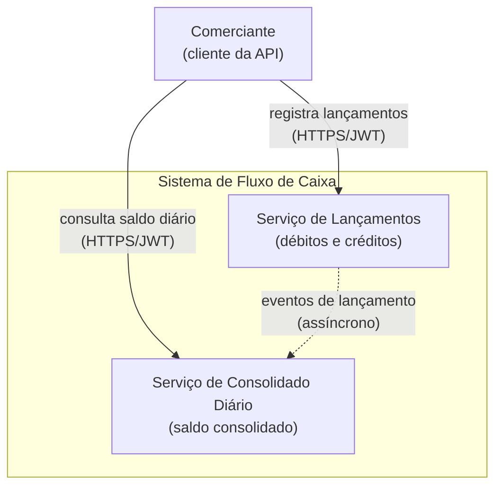
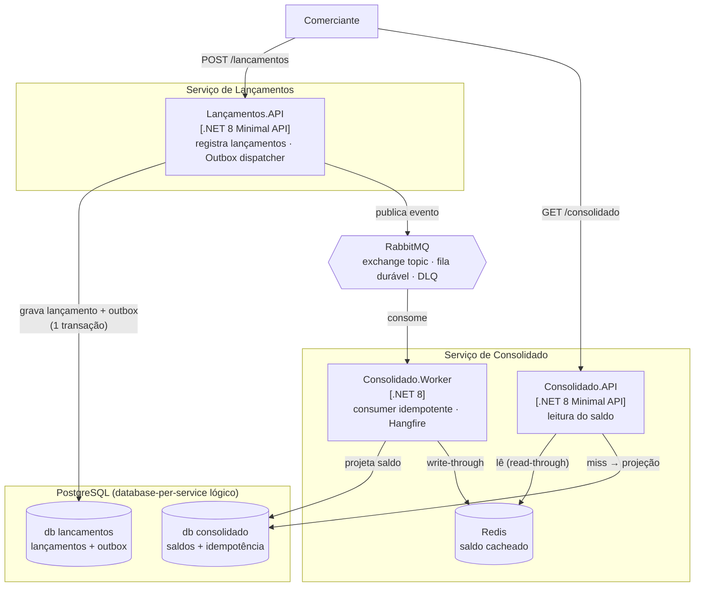
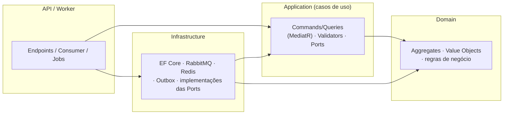
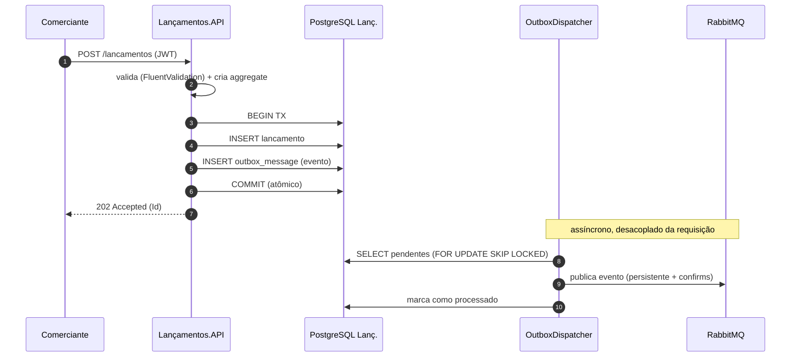
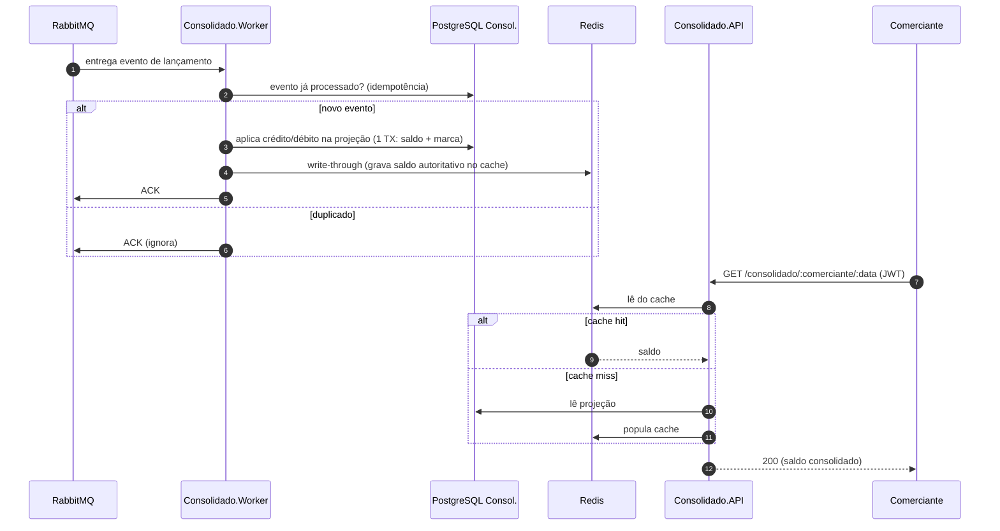
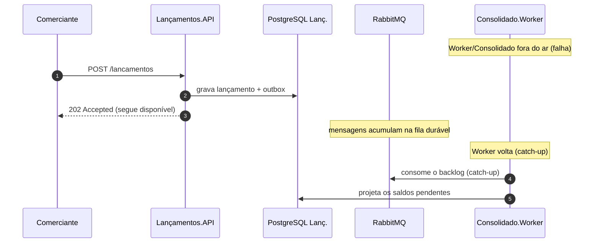

# Arquitetura — Fluxo de Caixa

Este documento descreve a arquitetura usando o **C4 Model** (níveis de Contexto e Container)
e diagramas de sequência. Os diagramas são em **Mermaid** (renderizam no GitHub).

## Índice
1. [C4 — Nível 1: Contexto](#c4--nível-1-contexto)
2. [C4 — Nível 2: Containers](#c4--nível-2-containers)
3. [C4 — Nível 3: Componentes (por serviço)](#c4--nível-3-componentes-por-serviço)
4. [Fluxo: registrar lançamento](#fluxo-registrar-lançamento)
5. [Fluxo: consultar consolidado](#fluxo-consultar-consolidado)
6. [Fluxo: resiliência (consolidado indisponível)](#fluxo-resiliência-consolidado-indisponível)
7. [Modelo de domínio](#modelo-de-domínio)

---

## C4 — Nível 1: Contexto

O comerciante interage com **dois serviços independentes**. A comunicação entre eles é
**assíncrona** (linha tracejada): o Consolidado é eventualmente consistente com os lançamentos.

---

## C4 — Nível 2: Containers

**Pontos-chave:**
- **Database-per-service (lógico):** cada serviço é dono do seu banco (`lancamentos`,
  `consolidado`), sem acesso cruzado. Em dev compartilham um mesmo servidor PostgreSQL; a
  separação física em instâncias dedicadas é só trocar o `Host` (ver [ADR 0002](adr/0002-database-per-service.md)).
- **Outbox dispatcher** roda dentro da `Lançamentos.API` (publicação confiável).
- **Worker** e **Consolidado.API** são deployables separados: o Worker consome e roda jobs;
  a API só lê. Assim a leitura (50 req/s) escala independentemente do consumo.

---

## C4 — Nível 3: Componentes (por serviço)

Cada serviço segue **Clean Architecture** — dependências sempre apontando para dentro:

A camada de **Application define as Ports** (interfaces: repositórios, Outbox, cache, clock);
a **Infrastructure as implementa** (Adapters). Domínio não depende de nada externo.

---

## Fluxo: registrar lançamento

O cliente recebe **202** assim que o lançamento é persistido. A publicação no broker é
responsabilidade do dispatcher, em segundo plano — por isso uma falha do broker **não afeta**
a resposta ao cliente.

---

## Fluxo: consultar consolidado

A leitura é servida por uma **projeção pré-calculada** + **cache** — nunca recalcula somando
lançamentos. É isso que sustenta o pico de 50 req/s.

---

## Fluxo: resiliência (consolidado indisponível)

O serviço de Lançamentos depende apenas do **seu** banco e do broker. A indisponibilidade do
Consolidado **não o derruba** — comprovado pelo teste de integração e pelo roteiro de
resiliência no [README](../README.md#demonstrar-a-resiliência-nfr-central).

---

## Modelo de domínio

**Lançamentos**
- `Lancamento` (aggregate root): comerciante, `Money` (VO, valor positivo), tipo (crédito/débito),
  data, descrição. Imutável após criado (fato contábil).

**Consolidado**
- `SaldoDiario` (projeção): totais de crédito/débito, saldo, quantidade, flag de fechamento.
  Atualizado incrementalmente a cada evento; concorrência otimista via `xmin`.
- `EventoProcessado`: chave de idempotência (EventId) gravada junto com a projeção.

Os tipos do contrato de integração (`BuildingBlocks.Contracts`) são propositalmente
**separados** dos enums de domínio — a camada de Application faz o mapeamento, preservando a
fronteira entre o modelo interno e o contrato externo.
